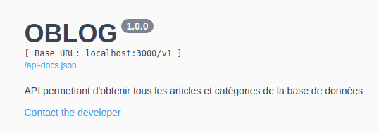
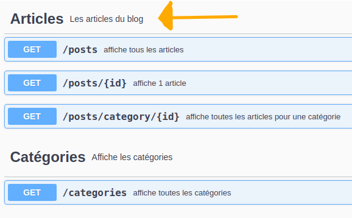

Express-swagger-generator pour afficher une page de doc / test

# Express-swagger-generator pour afficher une page de doc / test

Dispo sur npm ou [github](https://github.com/pgroot/express-swagger-generator)

## Mise en place

Le README du repo nous donne quelques lignes de code mais sans indications… Je vais essayer d’en apporter en fonction de ce que j’ai compris

### Installer

Exécuter la commande indiquée sur le repo ou npm

### Mettre en place

Dans le fichier de lancement de l’app (app.js ou index.js) insérer le code indiqué dans la rubrique “Usage” du repo ou npm.
Bien sûr il faudra peut-ête enlever le require d’express et l’écoute du port 😉

#### Informations complémentaires

Beaucoup de ces propriétés de ce bout de code sont personnalisables.
Par exemple l’extrait suivant servira d’en-tête de l’api de test :


```js
info: {
            description: 'API permettant d\'obtenir tous les articles et catégories de la base de données',
            title: 'OBLOG',
            version: '1.0.0',
            contact: {
                email: 'superdev@lessuperdev.com'
            }
        },
```

Il faut vérifier / modifier le chemin qui mène aux fichiers de route (`/**/*.js` signifie "tous les fichiers js avec la doc vont pouvoir être trouvés dans les sous-dossiers de `app/`") :

```js
files: ['./app/**/*.js'] //Path to the API handle folder
```

## Commenter les routes

Exemple avec une route dépendant d'un id

```js
/**
 * Affiche un post en fonction de son id
 * @group Articles - Les articles du blog
 * @summary affiche 1 article
 * @route GET /posts/{id}
 * @param {number} id.path - id de l'article concerné
 * @returns {object} 200 - a JSON of the values of the post
 * @returns {Error}  default - Unexpected error
 * 
 */
router.get('/posts/:id', postController.findOne);
```
### détail des infos notées 

Les éléments ci-dessous vont s'afficher dans les "bandeaux de routes" (en bleu sur l'image ci-dessous).

`@group` : permet de regrouper les routes (ici toutes les routes concernant les articles sont ensemble cf. image ci-dessous à côté de la flèche). Il faut lui ajouter :
- nom du groupe (ici Articles)
- une description (facultatif)



`@summary` + une petite description : s'affichera à côté de la route

`@route` : comme son nom l’indique concerne la route. Doit être associé avec:

- le verbe HTTP
- le chemin
- s’il y a un paramètre il faut le placer **entre accolades** ➡ `{id}` et non `{:id}` ou `:id`

Les infos suivantes s'afficheront quand on clique sur la route (un "menu" apparait, il permet notamment de tester la route en cliquant sur `try it out`)

`@param` : le paramètre attendu 
- type de donnée attendue entre les accolades 
- **rappel du nom du paramètre** suivi de `.path` : s'il n'y a pas l'association entre le paramètre renseigné avec `@route` et celui renseigné avec `@param` ça ne fonctionnera pas, tout comme si ce n'est pas suivi de `.path`) 
- une description : indiquer en clair à quoi correspond le paramètre requis

`@returns` : permet d'indiquer le type de données retournées.  Mettre 1 `@returns` pour les cas de réussite, et 1 pour l'échec. Spécifier
- le type retourné
- le code
- une description pour l'utilisateur

Il y a sûrement d'autres chose à indiquer mais je n'ai pas trouvé

## Accéder à l’API de test

La "doc" indique de se rendre à l'adresse en suivant  : `http://<app_host>:<app_port>/api-docs`

Dans notre cas il ne faut pas mettre `v1` ➡ ex. : `http://localhost:3000/api-docs`
